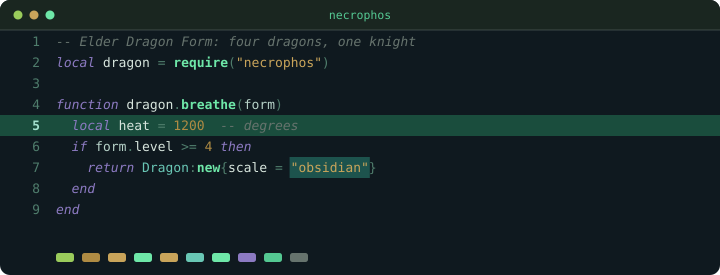
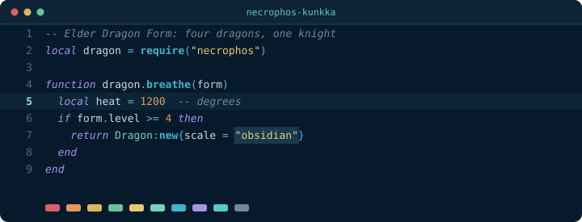
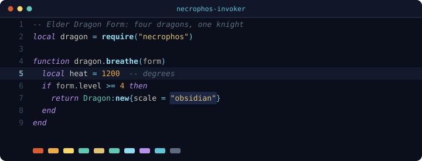
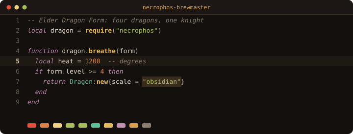
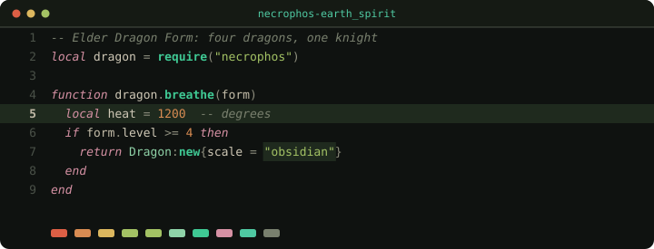
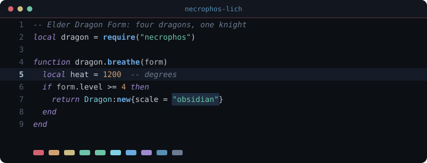
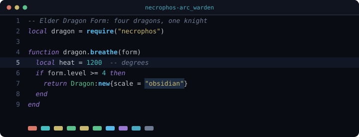
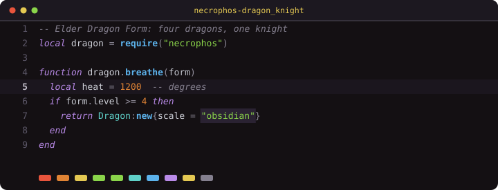

<div align="center">

# necrophos.nvim

**Eight Neovim colorschemes, each built from one Dota 2 hero's actual palette.**

Not eight tints of the same theme — eight different heroes, eight different sets of source colors,
each one traced back to something on the hero's model.

[](https://neovim.io)
[](https://lua.org)
[](#the-eight)
[](#license)

</div>

---

## The Eight

<!-- Every preview below is generated from the theme's real highlight groups. -->

### Necrophos — the Plague Doctor

Toxic green and grave purple over deep pine. The emerald staff, the plague mask, the rot it leaves behind.



### Kunkka — the Admiral

Night-ocean navy, Ghostship spectral teal, brass and admiral gold, cannon crimson. Tidebringer steel for operators.



### Invoker — the Arcane Mage

The three orbs, kept strictly apart: **Quas** ice for functions, **Wex** violet for keywords, **Exort** fire for constants, and Invoke's golden flash for warnings.



### Brewmaster — the Drunken Brawler

Brass keg, olive robe, Primal Fire over deep mahogany. Built from Mangix's model rather than a generic warm palette — which means **no blue anywhere**, because the hero has none. Jade stands in as the cool anchor.



### Earth Spirit — Carved from Jade

Sacred jade, fired terracotta, cold granite. Valve's lore says Kaolin was *carved from sacred jade* and buried with a stone funerary army, so the theme uses exactly those three materials. Also **no blue** — spirit jade marks functions, carved jade marks types.



### Lich — the Frozen Sovereign

Chain Frost cyan, Frost Armor mint, Sinister Gaze violet, and one warm crimson for errors so a failure never hides in the ice.



### Arc Warden — the Primordial Fragment

Flux plasma, Magnetic Field teal, Tempest indigo, Runic gold — a cosmic void lit only by electromagnetic discharge.



### Dragon Knight — Davion

Elder Dragon Form is canonically **four** dragons, and Valve picked them from opposite ends of the color wheel:

| Level | Form | Gets |
|:--|:--|:--|
| 1 | Green Dragon — Corrosive Breath | strings |
| 2 | Red Dragon — splash fire | errors, exceptions |
| 3 | Blue Dragon — frost | functions |
| 4 | Black Dragon — Aghanim's only | keywords |

Plus Davion himself: steel plate and gold trim. The widest hue separation of any theme here.



---

## Install

### [lazy.nvim](https://github.com/folke/lazy.nvim)

```lua
{
  "electromidz/necrophos.nvim",
  name = "necrophos",
  lazy = false,
  priority = 1000,
  config = function()
    require("necrophos").setup({
      theme = "dragon_knight",
      transparent = false,
    })
  end,
}
```

### [packer.nvim](https://github.com/wbthomason/packer.nvim)

```lua
use {
  "electromidz/necrophos.nvim",
  config = function()
    require("necrophos").setup({ theme = "necrophos" })
  end,
}
```

### [vim-plug](https://github.com/junegunn/vim-plug)

```vim
Plug 'electromidz/necrophos.nvim'
" then, after plug#end():
lua require("necrophos").setup({ theme = "lich" })
```

Requires a true-color terminal (`vim.opt.termguicolors = true`).

---

## Configure

```lua
require("necrophos").setup({
  -- "necrophos" | "kunkka" | "invoker" | "brewmaster"
  -- "earth_spirit" | "lich" | "arc_warden" | "dragon_knight"
  theme = "necrophos",

  transparent = false,
})
```

| Option | Type | Default | What it does |
|:--|:--|:--|:--|
| `theme` | `string` | `"necrophos"` | Which hero to load. An unknown name falls back to `necrophos` with a warning. |
| `transparent` | `boolean` | `false` | Clears the background on `Normal`, `NormalFloat`, and neo-tree's windows so the terminal shows through. |

> [!NOTE]
> `setup()` also accepts a `styles` table, but it is **not wired up yet** — italics and bold
> currently live in each theme's highlight groups (comments and keywords italic, functions bold).
> Passing `styles` today changes nothing.

---

## Use

### Commands

| Command | Does |
|:--|:--|
| `:Necrophos` | Load Necrophos |
| `:NecrophosKunkka` | Load Kunkka |
| `:NecrophosInvoker` | Load Invoker |
| `:NecrophosBrewmaster` | Load Brewmaster |
| `:NecrophosEarthSpirit` | Load Earth Spirit |
| `:NecrophosLich` | Load Lich |
| `:NecrophosArcWarden` | Load Arc Warden |
| `:NecrophosDragonKnight` | Load Dragon Knight |
| `:NecrophosToggleTheme` | Cycle through all eight, in order |
| `:NecrophosTransparentToggle` | Flip the background on and off |

### Lua

```lua
local necrophos = require("necrophos")

necrophos.set_theme("dragon_knight")  -- switch directly
necrophos.toggle_theme()              -- step to the next hero
```

Each theme also registers a `colors_name`, so `:colorscheme` reports
`necrophos`, `necrophos-kunkka`, `necrophos-lich`, and so on.

### A keymap worth having

```lua
vim.keymap.set("n", "<leader>ut", "<cmd>NecrophosToggleTheme<cr>", { desc = "Next hero" })
```

---

## How these palettes are built

A hero's colors are the starting point, not the finish line — "accurate to the splash art" and
"readable for eight hours" are different goals. Every theme is checked with a contrast script
before it ships, against three rules:

**1. Comments and syntax clear WCAG AA.** Every syntax foreground is measured against that theme's
own background and held at **≥4.5:1**. Comments are the usual casualty in dark themes — they get
pushed so far down they turn into texture. Here they stay legible while still receding.

**2. Tokens that appear together are separated by hue, not just lightness.** If strings, types, and
functions sit within a few degrees of each other, a dark theme collapses into one colored smear no
matter how good the individual colors are. Each theme documents its measured minimum gap across all
syntax pairs in its file header.

**3. Three distinct background steps.** `CursorLine` < `Visual` < `MatchParen`. Collapse the first
two and a visual selection becomes invisible on the line the cursor is already on — a genuinely
annoying bug that is easy to ship and hard to notice.

Each theme file carries its measured numbers inline, so the reasoning is auditable:

```lua
red   = "#e8543c", -- Red Dragon, Breathe Fire (errors) - H8  - 5.2:1
green = "#8ad44a", -- Green Dragon, Corrosive Breath     - H92 - 10.4:1
cyan  = "#5fd0c8", -- Frost breath (types)               - H176 - 10.2:1
blue  = "#5cb2eb", -- Blue Dragon (functions)            - H204 - 8.1:1
```

The palettes are also **complete**: every color a highlight group references is defined, and no
group carries a raw hex literal. Both are enforced across all eight themes.

---

## What gets themed

- **Tree-sitter** — the full `@` capture set, including `@markup.*` for Markdown
- **LSP** — diagnostics, underlines, references, signature help
- **Diffs and git** — `Diff*`, `diff*`, `gitcommit*`
- **Terminal** — all 16 ANSI slots, mapped per hero
- [**Telescope**](https://github.com/nvim-telescope/telescope.nvim) · [**which-key**](https://github.com/folke/which-key.nvim) · [**nvim-notify**](https://github.com/rcarriga/nvim-notify) · [**nvim-navic**](https://github.com/SmiteshP/nvim-navic) · [**nvim-dap-ui**](https://github.com/rcarriga/nvim-dap-ui) · [**Noice**](https://github.com/folke/noice.nvim) · [**indent-blankline**](https://github.com/lukas-reineke/indent-blankline.nvim)
- [**gitsigns.nvim**](https://github.com/lewis6991/gitsigns.nvim) inherits the themed `Diff*` groups, which is what it links to by default

File explorers use their own defaults; neo-tree is handled by the transparency toggle.

---

## Adding a hero

Each theme is one self-contained file in `lua/necrophos/themes/` returning three tables:

```lua
local theme = {}

theme.colors = { ... }           -- named palette, hero colors first
theme.groups = { ... }           -- highlight groups, referencing theme.colors only
theme.terminal_colors = { ... }  -- ANSI 0-15

return theme
```

Register it in `lua/necrophos/themes/` and add it to `M.themes` in `lua/necrophos/init.lua`,
plus a `:Necrophos<Name>` command and a step in `toggle_theme()`.

Two invariants to keep: no highlight group may reference a color that `theme.colors` does not
define, and no group may hardcode a hex value. Both are easy to check:

```vim
:lua local t = dofile("lua/necrophos/themes/lich.lua") print(vim.tbl_count(t.groups))
```

Then read the palette against a real buffer, not a swatch — colors that look striking in a strip
often turn out to be unreadable in a comment.

---

## License

MIT
